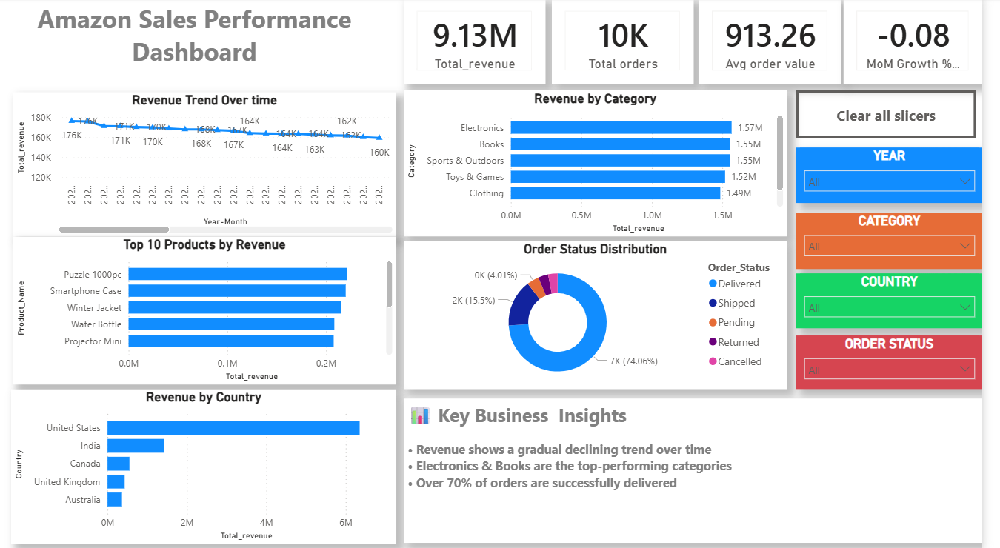
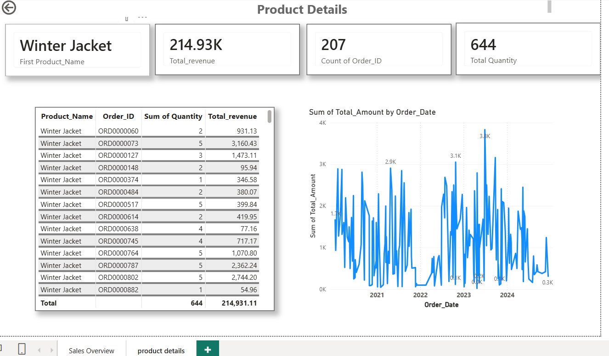

# Amazon Sales Analysis Dashboard

## 📊 Project Overview
This project analyzes Amazon sales data using SQL and Power BI to derive business insights and track performance.

## 🛠 Tools Used
- SQL (MySQL)
- Power BI
- Excel

## 📌 Key Insights
- Revenue shows a declining trend over time
- Electronics and Books are top-performing categories
- Over 70% of orders are successfully delivered

## 📈 Dashboard Features
- KPI metrics (Revenue, Orders, Quantity, AOV)
- Sales trend analysis
- Category and product performance
- Order status distribution
- Drill-through for product-level insights

## 📷 Dashboard Preview

